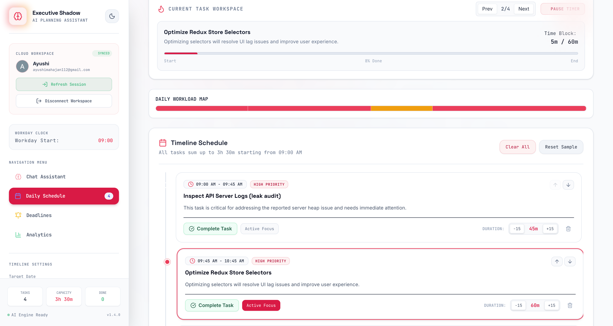

# Executive Shadow Assistant 🕵️‍♂️💼

An autonomous planning and scheduling assistant that extracts micro-tasks from messy briefs, emails, and voice transcripts, and arranges them on an interactive timeline calendar. Built to bring order to chaos and keep you in a flow state.

---

## ✨ Core Features & How They Work

### 1. Intelligent Task Ingestion
**How it works:** Paste in messy, unstructured text (like a raw voice transcript or a forwarded email chain). The AI automatically parses the text, extracts actionable micro-tasks, assigns priorities, and estimates time requirements. 
> *[📸 Screenshot Placeholder: Show the text input area with a raw transcript and the resulting parsed task cards]*

### 2. Interactive Scheduling Timeline
**How it works:** Once tasks are extracted, they are automatically arranged on your daily timeline. You can view your schedule hour-by-hour, ensuring deadlines are met and tasks fit perfectly around your existing calendar commitments.


### 3. Distraction-Free Focus Mode
**How it works:** When it's time to execute, enter "Focus Mode." The interface strips away all distractions, showing only the active task, a timer tracking your focused minutes, and essential controls to complete or pause the task.


### 4. AI-Powered Voice & Text Chat Assistant
**How it works:** Need to reorganize your day or summarize a brief? Open the Chat Assistant. Powered by the Gemini API, it acts as your "Shadow Assistant," understanding your schedule and helping you prioritize on the fly. You can interact via text or go hands-free using the microphone.
- **Example:** Click the mic and say: *"Move my 2 PM meeting to 4 PM"* or *"What are my top priorities for today?"*


### 5. Manual Daily Schedule & Deadline Management
**How it works:** In addition to AI extraction, you can directly add items to your daily schedule or deadline list. Just click the "Add" button in the respective section.
- **Example 1 (Schedule):** Add a custom time block: *10:00 AM - Sync with Marketing Team*
- **Example 2 (Deadline):** Add a hard deadline directly: *Submit Quarterly Report by Friday 5:00 PM*
> *[📸 Screenshot Placeholder: Show the manual add inputs for daily schedules and deadlines]*

### 6. Proactive Alerting & Email Notifications
**How it works:** The assistant actively monitors your deadlines. As tasks approach their due time, you'll receive in-app visual alerts.
- **1-Hour Email Alerts:** If a critical task is due within 1 hour, the system automatically dispatches an email notification via the Gmail API to ensure you never miss a deadline.
> *[📸 Screenshot Placeholder: Show a deadline with a 1-hour red alert badge and an email sent notification]*

### 7. Productivity Analytics Dashboard
**How it works:** Track your progress over time. The analytics dashboard visualizes your completed tasks, focus hours, and priority burndown using interactive charts, giving you insights into your most productive times.
> *[📸 Screenshot Placeholder: Show the Analytics Dashboard with Recharts visualizations]*

---

## 🛠️ Tech Stack

- **Frontend:** React, TypeScript, Vite
- **Styling:** Tailwind CSS, Framer Motion
- **Visualizations:** Recharts
- **Backend & Database:** Firebase (Auth, Firestore), Express
- **Integrations:** Gmail API (for sending emails)
- **AI:** Google AI Studio, Antigravity Agent, Gemini API

## 🚀 Getting Started

1. **Install Dependencies**
   ```bash
   npm install
   ```

2. **Environment Variables**
   Create a `.env` file based on `.env.example` and add your Gemini API Key:
   ```env
   GEMINI_API_KEY="your_gemini_api_key_here"
   APP_URL="http://localhost:3000"
   ```

3. **Firebase Setup**
   Ensure your Firebase project is configured and credentials are added to `firebase-applet-config.json` (this file is safely ignored by Git to protect your secrets).

4. **Run the Development Server**
   ```bash
   npm run dev
   ```
   *The server runs locally on port 3000.*

## 🔒 Security & Privacy

Your sensitive keys are kept safe. `.env` and `firebase-applet-config.json` are strictly excluded from source control via `.gitignore`, ensuring zero accidental leakage of API keys or database credentials to GitHub.
