 

### What is Executive Shadow Assistant? 🕵️‍♂️💼

Students, professionals, and entrepreneurs frequently miss deadlines and important commitments because traditional productivity tools rely on passive, easy-to-ignore reminders. Executive Shadow is an AI-powered productivity companion built to solve this. Instead of just reminding you of what you missed, it proactively assists you in planning, prioritizing, and completing tasks before deadlines slip through the cracks.
Moving beyond passive to-do lists, Executive Shadow acts as an autonomous planning and scheduling assistant. It extracts actionable micro-tasks from messy briefs, emails, and voice transcripts, and arranges them on an interactive timeline calendar. Built to bring order to chaos, it helps you take meaningful action, make better decisions, and stay in a flow state

## 🚀 Why Executive Shadow vs. Legacy Apps?

Older **"last-minute savior"** productivity apps are **reactive**—they wait until a deadline is almost here and then send a guilt-inducing notification. They assume you'll figure out **how** to complete the work on your own.

**Executive Shadow** takes a fundamentally different approach by planning your work **before it becomes an emergency**.

| Legacy Apps | Executive Shadow |
|--------------|------------------|
| ⏰ Wait until deadlines are close | 🗓️ Plans your work days in advance |
| 📋 Store vague to-do lists | ✅ Breaks projects into actionable micro-tasks |
| 🔔 Send last-minute reminders | 🤖 Automatically schedules focused work sessions |
| 🧠 Require manual planning | ⚡ Creates a realistic timeline for you |

### ✨ Actionable Micro-Tasks, Not Vague To-Dos

Instead of leaving you with a daunting task like:

> **"Write Q3 Report"**

Executive Shadow automatically breaks it into clear, executable actions such as:

- 📝 Draft the introduction
- 📊 Review Q2 metrics
- 📈 Analyze quarterly trends
- ✍️ Write conclusions
- ✅ Final review and submission

Knowing the **next step** makes it much easier to start.

---

### 📅 Proactive Planning Instead of Reactive Alerts

Rather than reminding you **the day before** a deadline, Executive Shadow intelligently schedules focused work blocks **earlier in the week**.

This ensures meaningful progress happens well before the task becomes urgent, reducing stress and preventing last-minute rushes.

---

### 🤖 Autonomous Scheduling

Executive Shadow doesn't just remind you—it plans for you.

It intelligently:

- 🎯 Prioritizes tasks based on urgency
- ⏱️ Estimates the time required
- 📆 Finds available focus blocks in your schedule
- 🚀 Builds a realistic execution timeline automatically

By eliminating the friction of manual planning, Executive Shadow helps you spend less time organizing work and more time completing it.
---

### Executive Shadow Agent Landing Page
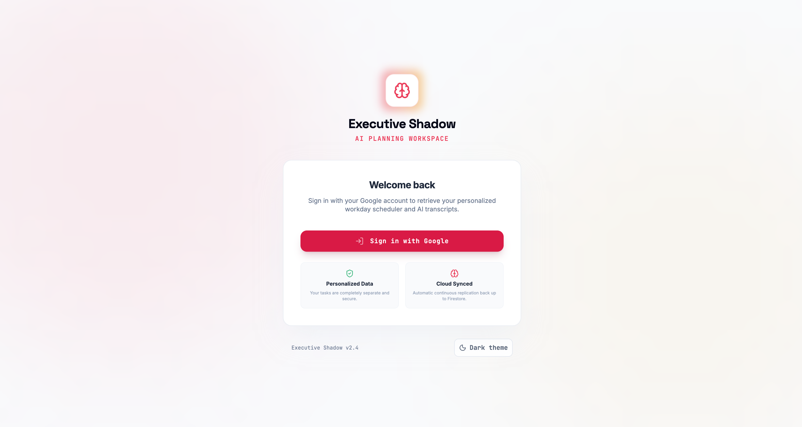

## ✨ Core Features & How They Work

### 1. Intelligent Task Ingestion
**How it works:** Paste in messy, unstructured text (like a raw voice transcript or a forwarded email chain). The AI automatically parses the text, extracts actionable micro-tasks, assigns priorities, and estimates time requirements. 

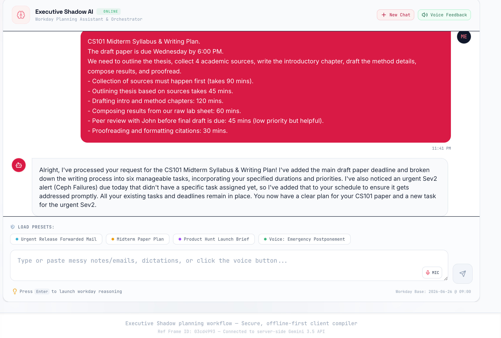

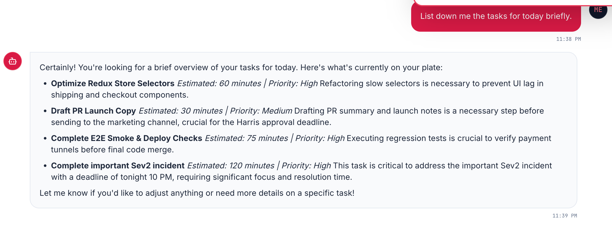

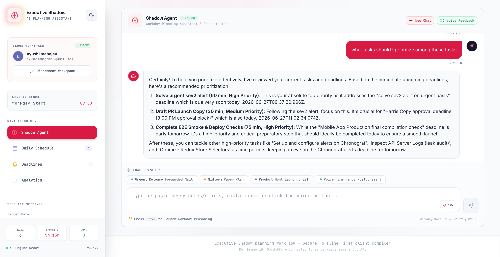

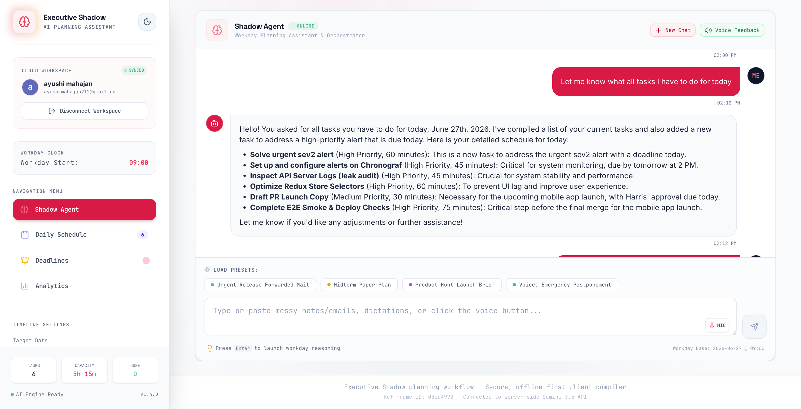

### 2. Interactive Scheduling Timeline
**How it works:** Once tasks are extracted, they are automatically arranged on your daily timeline. You can view your schedule hour-by-hour, ensuring deadlines are met and tasks fit perfectly around your existing calendar commitments.

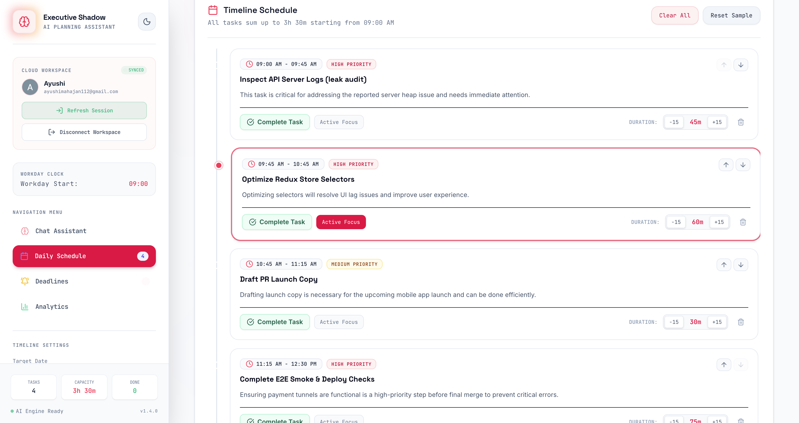

### 3. Distraction-Free Focus Mode
**How it works:** When it's time to execute, enter "Focus Mode." The interface strips away all distractions, showing only the active task, a timer tracking your focused minutes, and essential controls to complete or pause the task. Mark the task complete once you are all set.


### 4. AI-Powered Voice & Text Chat Assistant
**How it works:** Need to reorganize your day or summarize a brief? Open the Chat Assistant. Powered by the Gemini API, it acts as your "Shadow Assistant," understanding your schedule and helping you prioritize on the fly. You can interact via text or go hands-free using the microphone.
- **Example:** Click the mic and say: *"Move my 2 PM meeting to 4 PM"* or *"What are my top priorities for today?"*

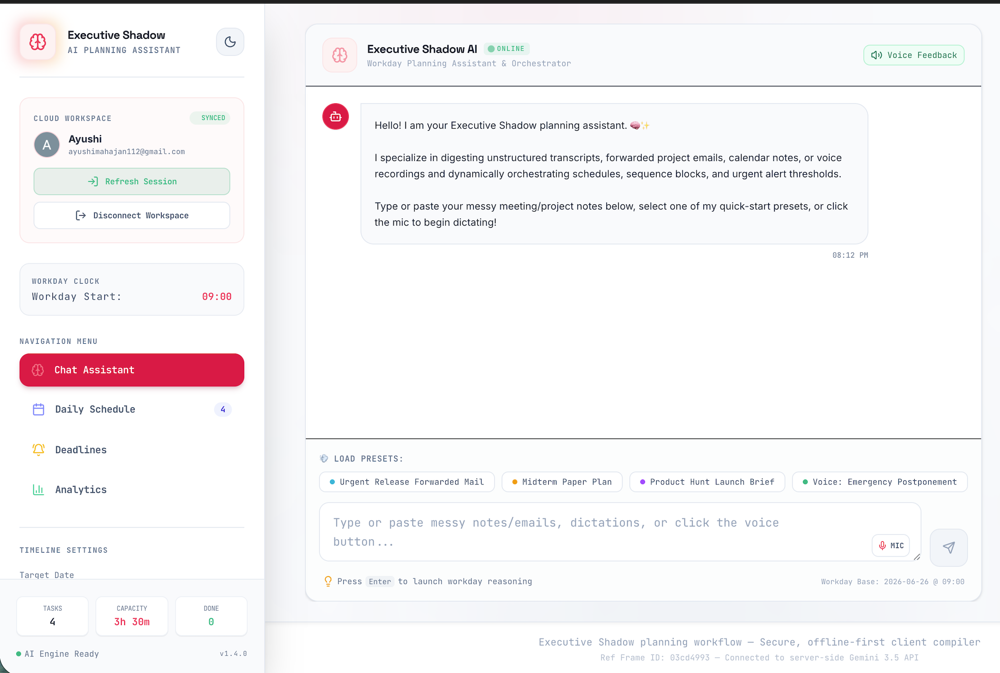

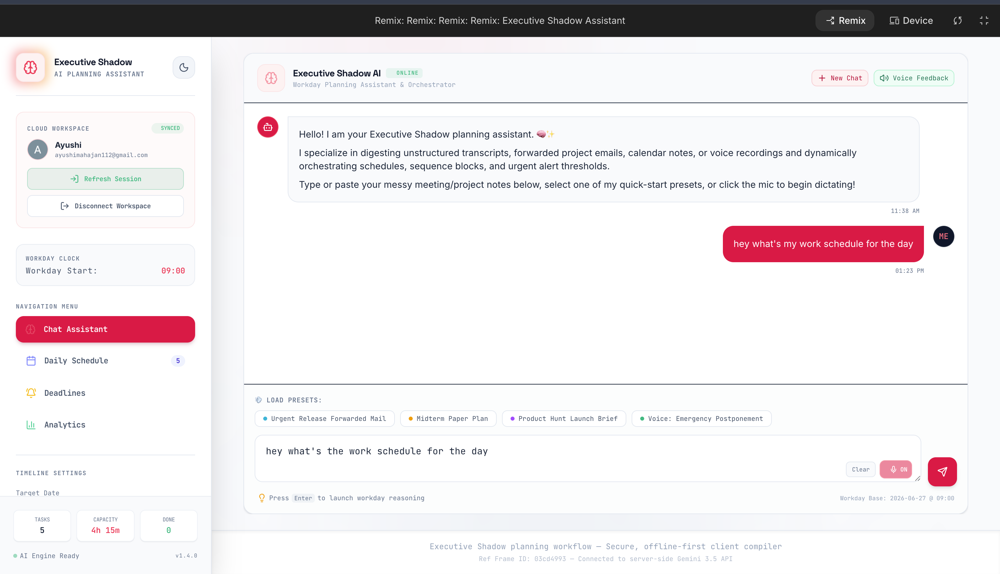

### 5. Manual Daily Schedule & Deadline Management
**How it works:** In addition to AI extraction, you can directly add items to your daily schedule or deadline list. Just click the "Add" button in the respective section.
- **Example 1 (Schedule):** Add a custom time block: *10:00 AM - Sync with Marketing Team*
- **Example 2 (Deadline):** Add a hard deadline directly: *Submit Quarterly Report by Friday 5:00 PM*

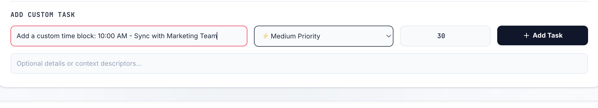

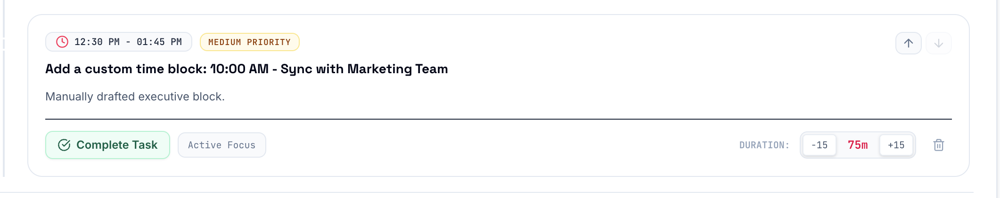

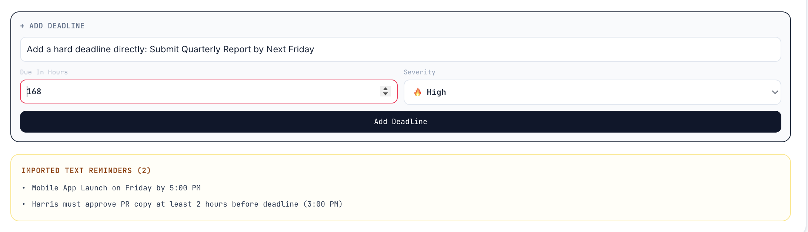

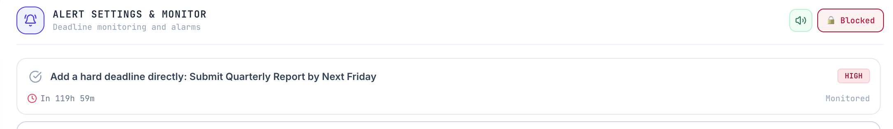


### 6. Proactive Alerting & Email Notifications
**How it works:** The assistant actively monitors your deadlines. As tasks approach their due time, you'll receive in-app visual alerts.
- **1-Hour Email Alerts:** If a critical task is due within 1 hour, the system automatically dispatches an email notification via the Gmail API to ensure you never miss a deadline.

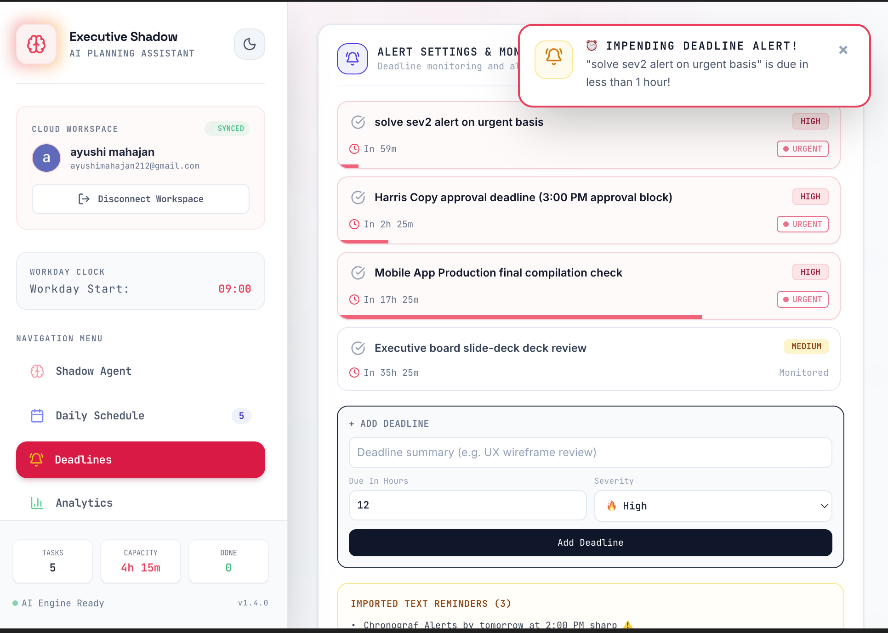

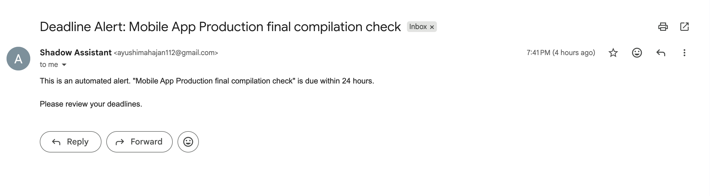

### 7. Productivity Analytics Dashboard
**How it works:** Track your progress over time. The analytics dashboard visualizes your completed tasks, focus hours, and priority burndown using interactive charts, giving you insights into your most productive times.
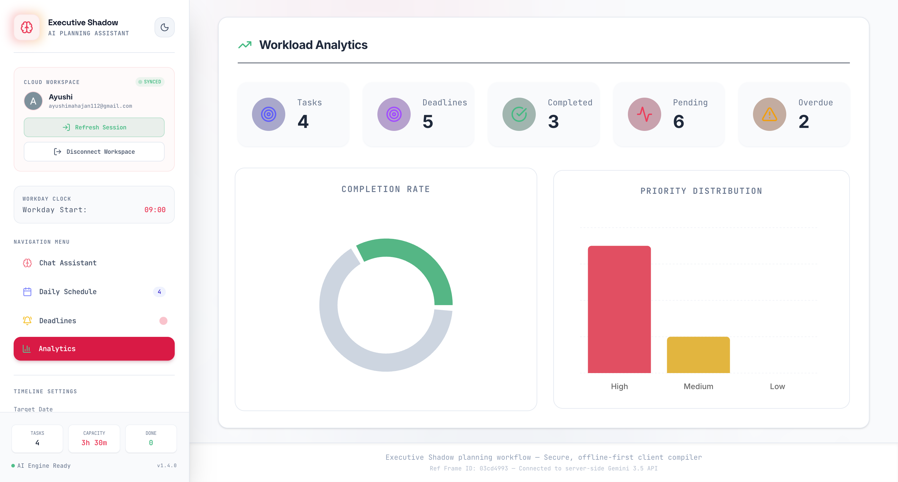

---

## 🛠️ Tech Stack

- **Frontend:** React, TypeScript, Vite
- **Styling:** Tailwind CSS, Framer Motion
- **Visualizations:** Recharts
- **Backend & Database:** Firebase (Auth, Firestore), Express
- **Integrations:** Gmail API (for sending emails)
- **AI:** Google AI Studio, Antigravity Agent, Gemini API

## 🚀 Getting Started

1. **Install Dependencies**
   ```bash
   npm install
   ```

2. **Environment Variables**
   Create a `.env` file based on `.env.example` and add your Gemini API Key:
   ```env
   GEMINI_API_KEY="your_gemini_api_key_here"
   APP_URL="http://localhost:3000"
   ```

3. **Firebase Setup**
   Ensure your Firebase project is configured and credentials are added to `firebase-applet-config.json` (this file is safely ignored by Git to protect your secrets).

4. **Run the Development Server**
   ```bash
   npm run dev
   ```
   *The server runs locally on port 3000.*

## 🔒 Security & Privacy

Your sensitive keys are kept safe. `.env` and `firebase-applet-config.json` are strictly excluded from source control via `.gitignore`, ensuring zero accidental leakage of API keys or database credentials to GitHub.
