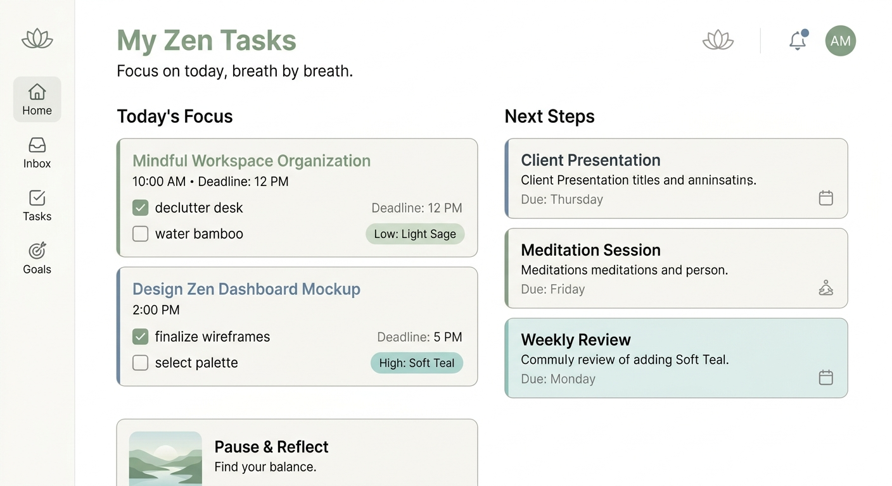
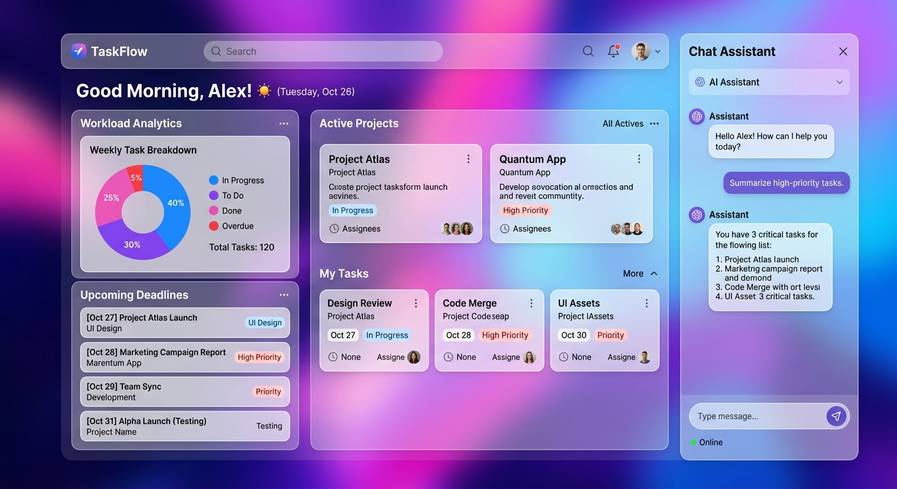
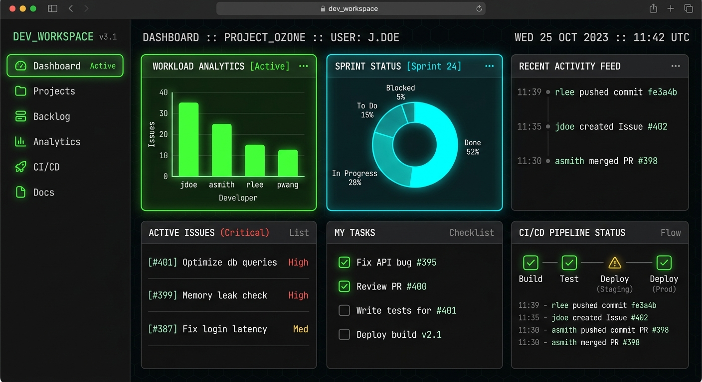

# Executive Shadow Assistant 🕵️‍♂️💼

An autonomous planning and scheduling assistant that extracts micro-tasks from messy briefs, emails, and voice transcripts, and arranges them on an interactive timeline calendar. Built to bring order to chaos and keep you in a flow state.

---

## 📸 Interface Previews

Here are some glimpses of the visual aesthetic and design themes available within the application:

<div align="center">
  
  
  
</div>

---

## ✨ Key Capabilities

- **🎙️ Intelligent Ingestion**: Extracts structured micro-tasks from messy inputs—like voice transcripts, forwarded emails, or quickly jotted notes.
- **📅 Interactive Timeline**: Automatically schedules your tasks around existing commitments, displaying them on a fluid, drag-and-drop timeline.
- **🤖 AI Chat Assistant**: Powered by the Gemini API, your shadow assistant can reorganize your day, summarize briefs, and prioritize what matters.
- **🎯 Focus Mode**: A dedicated, distraction-free execution environment that tracks your active time and prevents context switching.
- **📊 Analytics Dashboard**: Visualize your productivity with Recharts-powered graphs, tracking completion rates, focus hours, and priority burndown.
- **🔒 Secure Data**: Integrated with Firebase Authentication and Firestore to keep your data synced and private. We ensure sensitive configurations (`firebase-applet-config.json`) are Git-ignored!

## 🛠️ Tech Stack

- **Frontend**: React 19, TypeScript, Vite
- **Styling**: Tailwind CSS, Framer Motion (`motion/react`)
- **Visualizations**: Recharts
- **Backend & Database**: Firebase (Auth, Firestore), Express (Custom Server)
- **AI**: Google Gen AI SDK (`@google/genai`)

## 🚀 Getting Started

1. **Install Dependencies**
   ```bash
   npm install
   ```

2. **Environment Variables**
   Create a `.env` file based on `.env.example` and add your Gemini API Key:
   ```env
   GEMINI_API_KEY="your_gemini_api_key_here"
   APP_URL="http://localhost:3000"
   ```

3. **Firebase Setup**
   Ensure your Firebase project is configured and credentials are added to `firebase-applet-config.json` (this file is safely ignored by Git to protect your secrets).

4. **Run the Development Server**
   ```bash
   npm run dev
   ```
   *The server runs locally on port 3000.*

## 🔒 Security & Privacy

Your sensitive keys are kept safe. `.env` and `firebase-applet-config.json` are strictly excluded from source control via `.gitignore`, ensuring zero accidental leakage of API keys or database credentials to GitHub.
